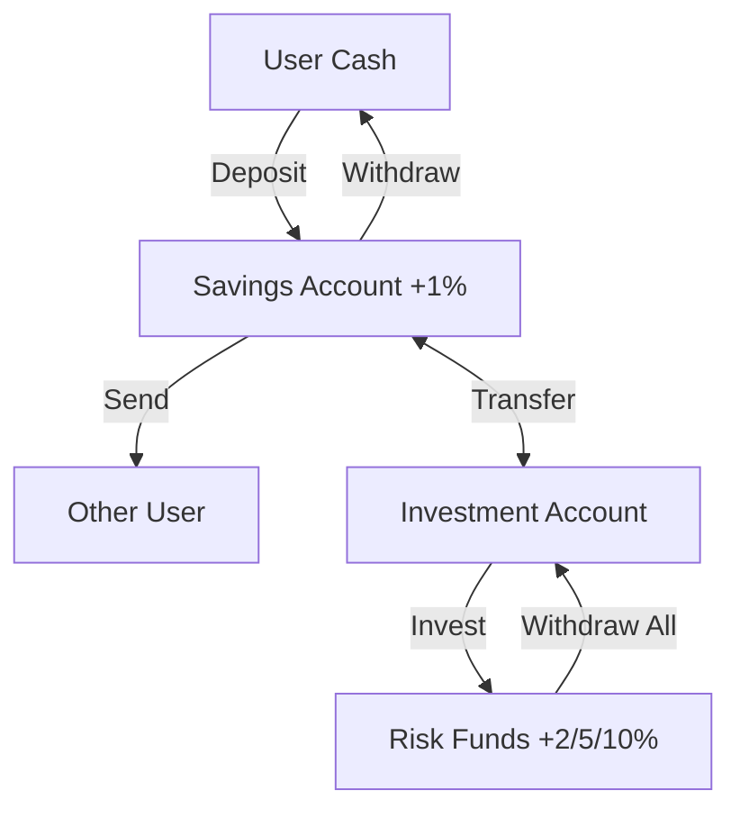

# Green Day Bank 🏦

A robust, feature-rich command-line banking application built in Java. This project goes beyond simple transaction logic to simulate a realistic financial environment with persistent state, fraud detection, and time-based interest accumulation.

> "How nice it would be if your savings and investments in your bank would only grow and never shrink. In this task you'll have an opportunity to build such a magical bank."

## Prerequisites ⚙️

- **Java JDK 17** or higher.
- A terminal that supports ANSI escape codes.

## Installation 📥

1. **Compile the source code**:

   ```bash
   javac -d build BankingApp.java service/*.java model/*.java exception/*.java util/*.java
   ```

2. **Run the application**:

   ```bash
   java -cp build BankingApp
   ```

## Features ✨

### Core Banking 💰

- 👥 **Multi-User System**: Registration and login with **AES-encrypted passwords**.
- 🏦 **Dual Account Architecture**:
  - **Savings Account**: Earns **1% risk-free interest** daily.
  - **Investment Account**: Access to high-yield risk funds.
- 💸 **Smart Transfers**:
  - **Internal**: Move money between your Savings and Investment accounts.
  - **External**: Send money to other users via **Estonian-style IBANs** (`EE...`) using **Real Checksum Validation**.
- 📈 **Investment Funds**:
  - 🛡️ **LOW_RISK**: Steady 2% growth.
  - ⚖️ **MEDIUM_RISK**: Balanced 5% growth.
  - 🚀 **HIGH_RISK**: Aggressive 10% growth.

### Advanced Capabilities 🧠

- ⚡ **Smart Transfers**: The app scans your transaction history to build a **"Quick Contact" list** of people you've sent money to before, speeding up payments.
- ⏳ **Time/Interest Engine**:
  - **Manual Advance**: Skip days forward to test growth.
  - **Auto-Catchup**: If you don't login for 5 days, the system detects this on your next login and calculates 5 days of value-dates, ensuring you never lose interest.
- 🚨 **Fraud Detection System**:
  - Monitors for suspicious activity (transfers > $10,000).
  - **3-Strike Rule**: Automatically freezes accounts with 3 suspicious transactions in 24 hours.
- 💾 **Fault-Tolerant Persistence**:
  - All data (Users, Transactions) is saved to `database/*.csv`.
  - The custom parser **recover gracefully from corruption**—skipping only bad lines without crashing the app.

## Project Evolution 📈

This project expands significantly on the original curriculum requirements:

| Feature | Original Requirement | Enhanced Implementation |
|---------|----------------------|-------------------|
| **Interest** | Added only on "View Balance" | **Time Engine**: Gains are calculated per-day. The system even "catches up" missed days if you haven't logged in for a while. |
| **Security** | None specified | **Fraud Detection**: Large transactions trigger warnings. Account freezing logic protects the bank. |
| **Identity** | Simple Usernames | **IBAN System**: Unique IBANs with valid checksum generation (mod 97). |
| **Persistence** | Session only | **CSV Persistence**: Custom `DataStore` class handles serialization and corruption recovery. |
| **Economy** | $1,000 Starting Cash | **$10,000 Starting Cash**: Increased to facilitate testing of high-value fraud limits. |

## Usage 🚀

### Interactive Menu

The application features a rich CLI with ANSI colors and ASCII art.

#### 1. Authentication Screen

```text
  _______________________________________________________
 |                                                       |
 |    _____                         _____                |
 |   / ____|                       |  __ \               |
 |  | |  __ _ __ ___  ___ _ __     | |  | | __ _ _   _   |
 |  | | |_ | '__/ _ \/ _ \ '_ \    | |  | |/ _` | | | |  |
 |  | |__| | | |  __/  __/ | | |   | |__| | (_| | |_| |  |
 |   \_____|_|  \___|\___|_| |_|   |_____/ \__,_|\__, |  |
 |                                                __/ |  |
 |          BANK     APP                         |___/   |
 |_______________________________________________________|

1. Login
2. Register
0. Exit
Choose an option: 
```

#### 2. Main Dashboard

```text
--- Banking App Menu ---
Date: 2025-12-16 12:00
------------------------
1. Show balance
2. Deposit money
3. Withdraw money
4. Send money to a person
5. Invest in funds
6. Transfer between accounts
7. Withdraw all investments
8. View Transaction History
9. Logout
10. Advance Time (1 Day)
11. Exit
12. About Fraud Prevention
```

### Money Flow



## Technical Highlights 💡

### 1. Zero-Dependency CSV Parsing & Recovery 🧱

Instead of using external libraries or fragile parsing, `DataStore.java` implements a robust recovery mechanism. It validates every field (dates, amounts, user references) and skips *only* corrupted records.

```java
// DataStore.java logic snippet
try {
    // ... parse fields ...
    if (cash.compareTo(BigDecimal.ZERO) < 0) {
        logError("Negative cash amount");
        skippedRecords++;
        continue; // Skip this line, preserve others
    }
} catch (Exception e) {
    // Catch malformed lines prevents app crash
    skippedRecords++;
}
```

### 2. Time-Based Interest Simulation 🕰️

The `TimeManager` class separates "System Time" from "Simulation Time". When you advance time, it loops through each day to correctly apply compound interest.

```java
public void advanceTime(int days) {
    currentSimulationTime = currentSimulationTime.plusDays(days);
    for (int i = 0; i < days; i++) {
        performDailyProcessing(); // Compounds interest daily
    }
}
```

### 3. Security Architecture 🏰

- 🔐 **Password Encryption**: Implemented a custom **Affine Cipher** (`E(x) = (ax + b) mod 26`) manually, without using Java's cryptography libraries.
- 🕵️ **Fraud Logic**: `FraudDetector` analyzes rolling transaction history windows (`ChronoUnit.HOURS`) to enforce the "3 strikes" suspension policy.

## Project Structure 📂

```text
bankingApp/
├── BankingApp.java              # Entry point
├── database/                    # CSV Persistence Layer
├── model/                       # Domain Entities (User, Account, Transaction)
├── service/                     # Business Logic
│   ├── authentication/          # Login/Register flows
│   ├── TimeManager.java         # Interest simulation
│   ├── FraudDetector.java       # Security rules
│   └── ...
├── util/                        # Helpers (IBAN gen, Cipher, CSV store)
└── exception/                   # Custom business exceptions
```

## OOP Principles 🏗️

The project rigorously applies core Object-Oriented principles:

| Principle | Implementation |
|-----------|----------------|
| **Encapsulation** | `User` state (cash, accounts) is private; modified only via transaction methods. |
| **Abstraction** | `Account` abstract class defines the contract for `applyGains()`, hiding implementation details. |
| **Inheritance** | `SavingsAccount` and `InvestmentAccount` extend the base `Account` class. |
| **Polymorphism** | `applyGains()` is overridden to provide different growth rates per account type. |
| **Composition** | `BankingService` acts as a facade, delegating to specialized services (`TransferService`, `FraudDetector`). |

## What I Learned 🧠

- 📐 **System Design**: Implementing a "Time Machine" required separating simulation time from system time, a pattern useful for event-driven simulations.
- 🛡️ **Defensive IO**: Writing a parser that can survive corrupt data taught me the importance of fault tolerance in persistence layers.
- 🔐 **Security First**: Integrating fraud detection checks into the core transaction loop demonstrated how to enforce business policies at the architectural level.

## Potential Future Improvements 🔮

- 🖥️ **GUI Version**: Porting the rich CLI logic to a JavaFX dashboard.
- 🌐 **Real-time Networking**: Converting the `TransferService` to use sockets for real P2P money transfers.
- 🗄️ **Database Integration**: Replacing CSV persistence with SQLite or PostgreSQL for better scalability.
- 👑 **Backend Admin System**: Implementing a backend admin system to manage users and accounts, unfreeze accounts, etc.

## Creator

**Lauri Lepik**

---
*Developed as a solo project for the **[kood/Nooremarendaja](https://kood.tech/kood-nooremarendaja/)** curriculum (Free, **[NextGenEU](https://kood.tech/meist/toetused/)** funded, 5-month intensive).*
