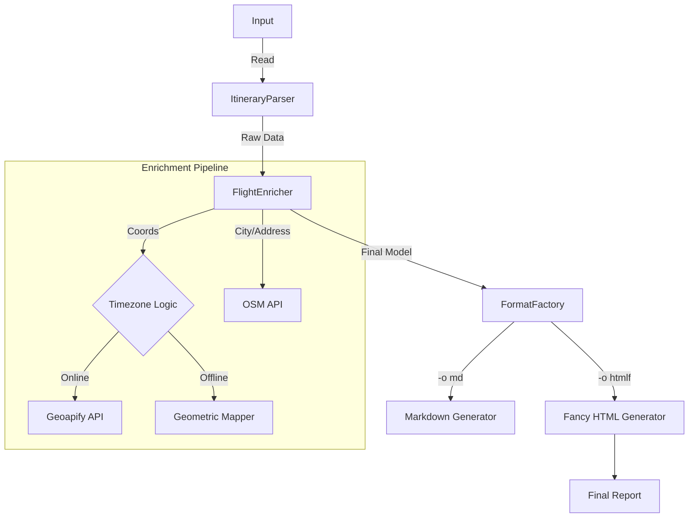

# Itinerary Prettifier ✈️

> **A CLI tool that cleans up messy flight data and turns it into nice-looking documents.**

## The Challenge 🛑

**"Anywhere Holidays"**, a new online travel agent, had a problem: their booking system spat out raw, hard-to-read text files meant for backend admins, not customers. These itineraries were full of:

- **Crypto-codes**: `IATA (#LAX)` and `ICAO (##EGLL)` codes instead of city names.
- **Unfriendly Dates**: ISO 8601 timestamps (e.g., `2007-04-05T12:30-05:00`) instead of readable dates.
- **Visual Clutter**: Too much whitespace and system artifacts.

My goal was to automate this cleanup. I decided to go a bit further than the basic requirements to build something that feels like a real production tool.

---

## My Solution: Prettifier NEXT ✨

The assignment just asked for a text cleaner, but I built **"Extended Mode"** to do more: it actually understands the flight data, finds missing info (like timezones), and generates HTML reports.

### Improvements & Key Features

| Feature | Original Requirement | My Implementation |
|---------|---------------------|-------------------|
| **Airport Lookup** | Basic CSV matching | **Smart Hybrid**: Uses offline CSV + Online APIs (Nominatim) for full addresses. |
| **Timezones** | Display raw offset | **Auto-Detection**: Calculates real-time offsets using Offline geometric logic or Online APIs. |
| **Output** | Text file only | **Multi-Format**: Generates Plain Text, **Markdown**, **HTML**, and **Fancy HTML**. |
| **Duration Calc** | ❌ No | **Auto-calculated** for every flight segment. |
| **Date Formatting** | Fixed ISO only | **Customizable** via the `--format` flag. |
| **Country Flags** | ❌ No | **Auto-Generated** Unicode emojis (🇺🇸 🇬🇧) from country codes. |
| **Random Wishes** | ❌ No | **Dynamic Branding** with randomized travel-themed messages. |
| **Diagnostics** | ❌ None | **Rich Telemetry**: Verbose mode (`-v`) shows API calls, stats, and warnings. |
| **Usability** | Explicit paths required | **Smart Crawling**: Auto-finds files in project subdirectories. |
| **UX** | Silent execution | **Rich CLI**: ANSI-colored logs and progress feedback. |

---

## Technical Highlights 💡

### 1. Dual-Mode Architecture (Requirements vs. Extras) 🏎️

To meet the curriculum requirements while still building the tool I wanted to make, I implemented two distinct engines:

- **Base Mode**: A simple, dependency-free implementation that follows the project rules exactly (Text output, Regex processing).
- **Extended Mode**: The "Showcase" (`-e` flag) where I added the advanced engineering: Object-Oriented design, API integration, and HTML reporting.

### 2. Resilient "Hybrid" Logic 🧠

The tool uses a mix of online APIs and offline algorithms to get the best of both worlds:

- **Intelligent Fallbacks**: It tries to get live data from APIs (Nominatim/Geoapify) first, but automatically switches to local algorithms if the internet is down (or you're on a plane).
- **Geometric Timezone Mapper**: I integrated [LatLongToTimezone](https://github.com/drtimcooper/LatLongToTimezone) by **Tim Cooper**. This 26k+ line decision tree (`TimezoneMapper.java`) uses Point-in-Polygon algorithms to detect timezones without any network requests.
- **Recursive File Crawling**: `FileResolver.java` implements a custom recursive walker that hunts for files up to 5 levels deep, so you can just type `input` instead of the full path `./data/2023/jan/input.txt`.

### 3. Advanced Data Engineering 🔧

- **Dynamic CSV Parsing**: `AirportLookup.java` actually reads the header row to find column indices, so it won't break if the source CSV changes its column order.
- **Embedded CSS Engine**: `HtmlFancyFormatter` uses Java Text Blocks to embed a full responsive design system (CSS Grid/Flexbox), so the HTML reports look great and are self-contained files.
- **Unicode Magic**: `CountryFlags.java` programmatically converts ISO country codes (e.g., "US") into emoji flag sequences (🇺🇸) using character code point math.
- **Time-Aware Duration**: `Flight.java` calculates accurate flight durations using `java.time.Duration` and `ZonedDateTime`, correctly interpreting ISO timestamps across different timezones.

### 4. Interactive Console UX 🎨

- **Legacy Terminal Support**: `TextFormatter.java` includes regex logic to strip emojis/Unicode when generating plain text output, ensuring compatibility with older non-UTF8 terminals.
- **Human-Readable Timezones**: A custom `TimezoneAbbreviations` map converts raw offsets (e.g., `+02:00`) into familiar codes (e.g., `EET`, `EST`) for better readability.
- **ANSI Color System**: `ConsoleUtils.java` provides a lightweight, dependency-free wrapper for terminal colors.
- **Rich Telemetry**: Verbose mode tracks API calls, execution time, and data quality warnings, simulating a production-grade microservice.

### Architecture



---

## 🚀 Usage

### 1. The Simple Way (Base Requirements)

Converts codes to names and formats dates.

```bash
java Prettifier ./input.txt ./output.txt ./airport-lookup.csv
```

### 2. The Professional Way (Extended Mode)

Enable `-e` to generate a beautiful HTML report with timezone conversions.

```bash
# Generate a fancy HTML report with verbose logging
java Prettifier -e -v -o htmlf --tz Europe/Tallinn input output airport-lookup
```

### Options

| Flag | Description |
|------|-------------|
| `-e` | Enable **Extended Mode** (Enrichment + Formats). |
| `-o <type>` | Output format: `txt`, `md`, `html`, `htmlf` (default: `txt`). |
| `-v` | Enable verbose logging (stats, warnings). |
| `-p` | Print output to console (stdout) with ANSI colors. |
| `--tz <zone>` | Convert all times to a specific timezone (e.g., `Europe/London`). |

---

## 🏗️ Setup & Compilation

**Requirements**: Java 17+

```bash
# Compile all sources (Base + Extended + Libs)
javac -encoding UTF-8 -d build *.java lib/*.java extended/*.java extended/format/*.java

# Run
java -cp build Prettifier -e -o htmlf input output airport-lookup
```

## What I Learned 🧠

- **Systems Thinking**: Designing a "Dual-Mode" architecture taught me how to balance conflicting requirements: speed (Regex) vs. complexity (Object Model).
- **The "Real World" is Messy**: Handling raw ISO timestamps and dirty data inputs reinforced the importance of writing defensive code that fails gracefully.
- **Offline Constraints**: Solving the timezone problem without API calls forced me to research and implement geometric algorithms (Point-in-Polygon), dramatically improving my algorithmic confidence.

## Potential Future Improvements 🔮

- **PDF Generation**: Adding a library like iText to generate printable board-style boarding passes.
- **Natural Language Parsing**: Using simple NLP to understand queries like "Show me flights to London next Tuesday".
- **GUI Wrapper**: Building a simple JavaFX front-end for drag-and-drop usage.

---

## Creator 👨‍💻

**[Lauri Lepik](https://github.com/LauriLepik)**

---
*Developed as a solo project for the **[kood/Nooremarendaja](https://kood.tech/kood-nooremarendaja/)** curriculum (Free, **[NextGenEU](https://kood.tech/meist/toetused/)** funded, 5-month intensive).*
